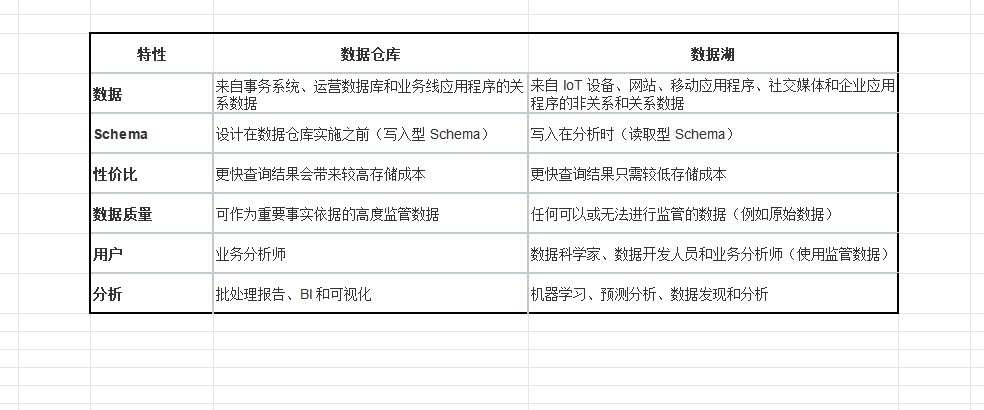
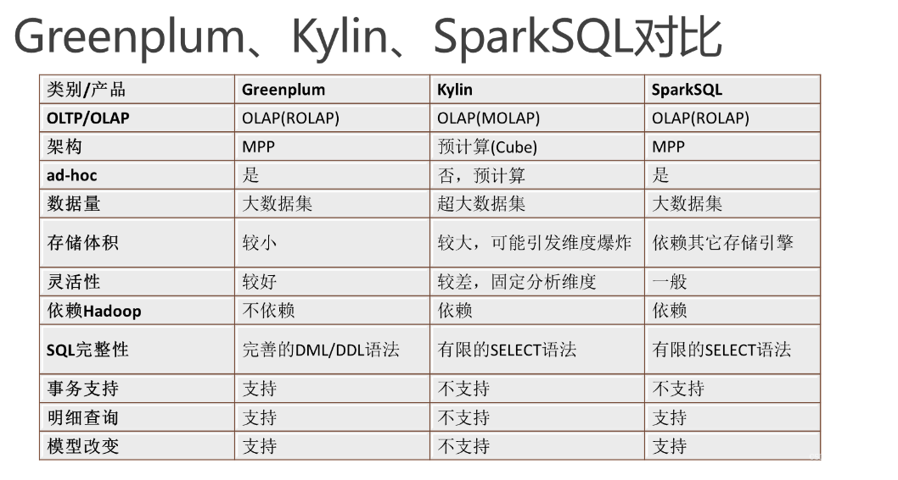

一、数据管理
    1.批处理 spark
    2.流处理 fink 
    3.机器学习 tensorFlow
    4. 事件处理 phoenix(驱动型的高性能 Java 开发框架 )
   **批处理系统按顺序处理大量数据和请求，而流处理则持续分析流经系统或设备之间的数据。 流处理监控实时数据，并在网络中持续传递这些数据。 流处理需要更多的处理能力来监控大量数据。 当流式传输的数据大小未知或无限大时，流式传输数据可能比批处理更可取
二、数据采集
	1.数据同步 CDC
	2.数据抽取 kettle/datax
	3.数据采集	Flume/logstash
	4.数据队列	kafka
	5.数据爬虫  Qspider
三、数据治理
	1.无数据	2.数据血缘管理	3.数据质量管理	4.数据稽查	5.数据安全
四、数据服务
	数据检索，数据可视化，数据模型管理，数据开放接口，数据编排，治理报告，推荐系统，数据智能服务
五、OLAP与OLTP
	OLAP 与OLTP. 联机分析处理(OLAP) 系统的主要用途是分析聚合数据，而联机事务处理(OLTP) 系统的主要用途是处理数据库事务。 您使用OLAP 系统来生成报告、执行复杂的数据分析和确定趋势。 相比之下，您使用OLTP 系统来处理订单、更新库存和管理客户账户。
	OLAP分类
六、hive与hbase区别
	Hive 旨在让非程序员熟悉 SQL，并使用名为 HiveQL 的类似于 SQL 的界面对 PB 级数据进行操作 hive 用于批处理，hbase用于实时处理
七、数据仓库与数据湖区别 
 
 